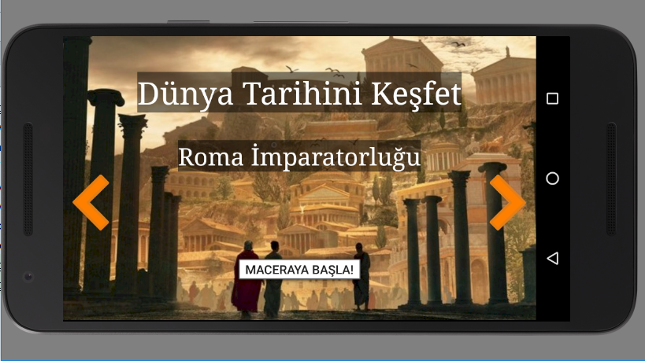
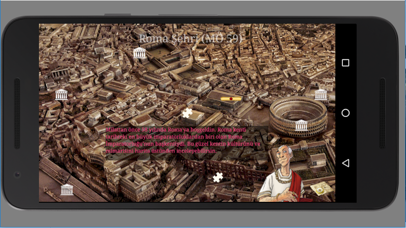
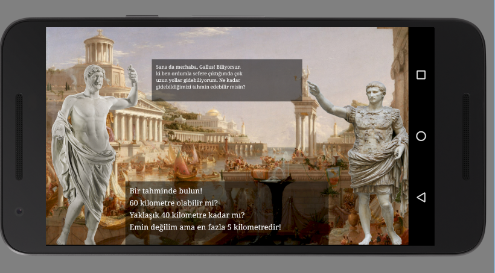
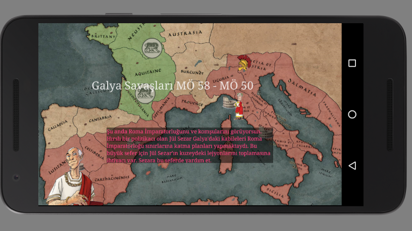

# Roket Takımı MUG2019 Uygulaması

Ahmet Atahan Mutlu, Çağatay Sel ve Kaan Kıranbay olarak Mobil Uygulama Geliştirme (MUG) Maratonu 2019 için geliştirdiğimiz uygulamamıza geldiniz. Uygulamamızın amacı tarih eğitimini işitsel, görsel ve eğlence faktörleriyle pekiştirerek tarih eğitimini daha ilginç ve verimli bir hale getirmekti.

   

Demomuz için Roma İmparatorluğunu ve MÖ 58 yılını seçtik. Bu dönemi yazılı ve sesli şekilde geliştirdiğimiz bir tarih anlatıcımız yardımıyla çocuklara anlatıyoruz. 

---

   

Uygulamamızın giriş ekranında kullanıcılarımızı Roma şehrinin o tarihlerdeki bire bir modeli karşılamakta ve kullanıcılar şehirdeki yapılarla etkileşime geçip bilgi alabilmektedirler. Bu ekranımızda çocuklara seçtikleri uygarlığın ve döneminin mimarisini görsell ve etkilişimli bir şekilde anlatmayı hedefledik. Bu ekrandaki parşömene tıklandığında, Romalı 2 vatandaşın konuşmasına şahit oluyoruz.

---

   

Bu diyalogda çocuklara o dönemin sosyokültürel yapısı hakkında kısa bilgiler veriyoruz ve sorular sorarak kullanıcının uygulama ile etkileşime geçmesini sağlıyoruz.    

---

 

Şehir ekranının köşesinde bulunan harita simgesine tıklayarak kullanıcılar harita sahnesine geçebiliyorlar. Bu sahnede çocuklar seçilen dönem ve uygarlığın sınırlarını ve komşularını görebiliyorlar. Harita üstünde çocuklar Jül Sezar'ın Galya Seferlerini oynuyorlar. Bu ekran ile çocuklara tarihi savaşları ve önemli olayları  harita üstünde, sebep ve sonuçları ile anlatmayı amaçlıyoruz.

